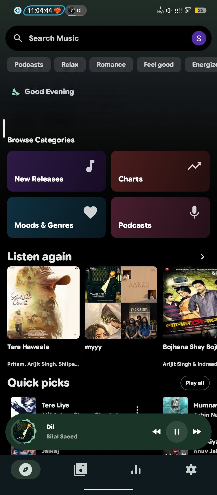
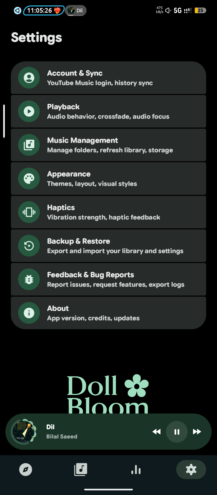
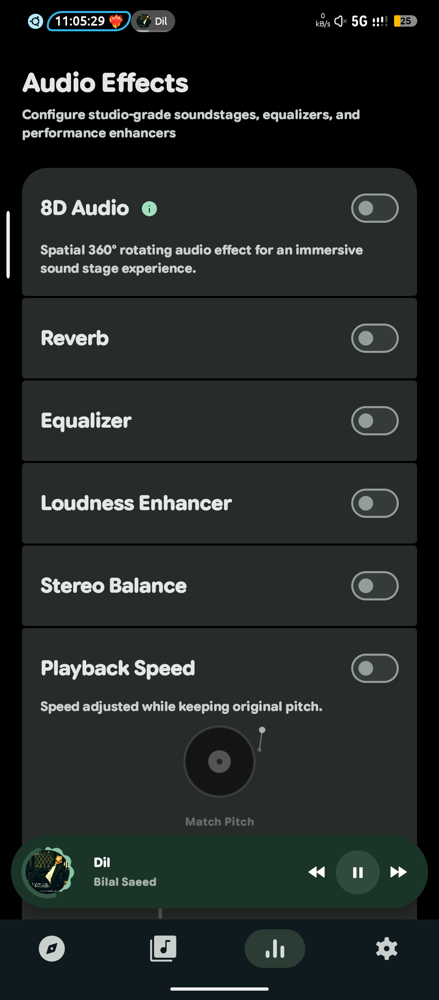
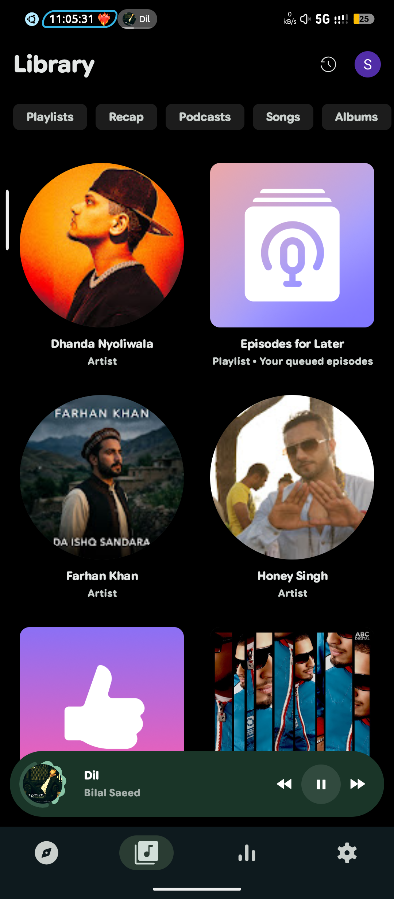
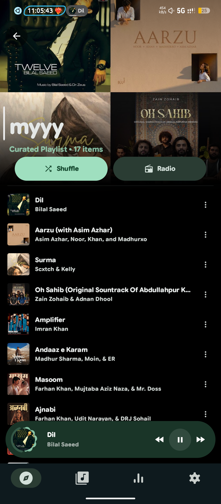
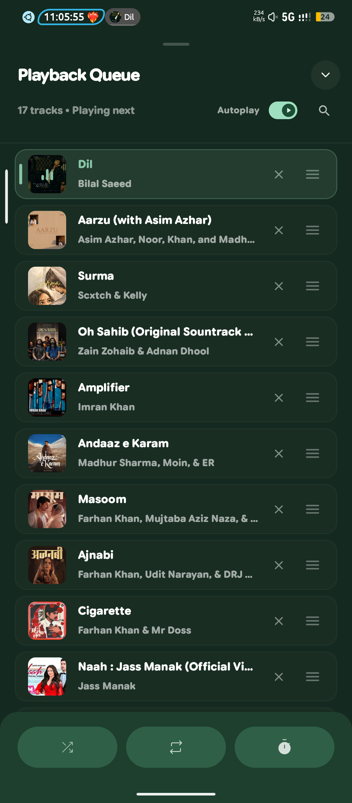

    
    <h1>DominatorMusic 🎶</h1>
    
An Android application for seamless music streaming

I was previously maintaining two apps, but now I will focus only on DollBloom🌸 to make it better and more amazing ❤️.

---

  
   
  
    
  

---

  
  
  

  
  
  

## Features

- Play (almost) any song or video from YouTube Music
- Play music from your device
- Play songs in the background
- Cache song for offline playback
- Search for songs, albums, artists videos and playlists
- Discover new songs by mood/genre
- Import playlists from YouTube
- Fetch, display and edit songs lyrics or synchronized lyrics
- Manage your playlists locally or synchronize with the cloud
- Highly customizable (dynamic theme, Material You, ...)
- Normalize audio for the perfect listening experience
- Listen from your car using Android Auto
- Open YouTube/YouTube Music links (`watch`, `playlist`, `channel`, etc.) with ViTune
- Ridiculously lightweight APK

## Installation

## Acknowledgments

- [**YouTube-Internal-Clients**](https://github.com/zerodytrash/YouTube-Internal-Clients): A Python
  script that discovers hidden YouTube API clients. Just a research project.
- [**ionicons**](https://github.com/ionic-team/ionicons): Premium hand-crafted icons built by Ionic,
  for Ionic apps and web apps everywhere.
- [**Flaticon: Ilham Fitrotul Hayat**](https://www.flaticon.com/authors/ilham-fitrotul-hayat): the
  app's logo uses a music note icon.

## Disclaimer

This project and its contents are not affiliated with, funded, authorized, endorsed by, or in any
way associated with YouTube, Google LLC or any of its affiliates and subsidiaries.

Any trademark, service mark, trade name, or other intellectual property rights used in this project
are owned by the respective owners.

## Credit 
°vimusic
°viTune
°OutterTune
°SpatialFlow
